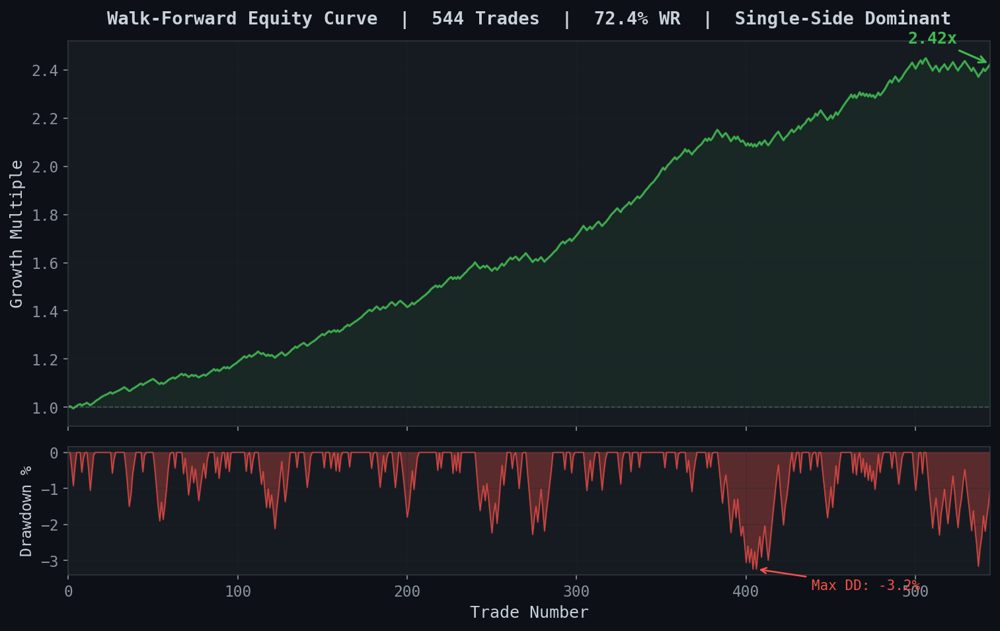
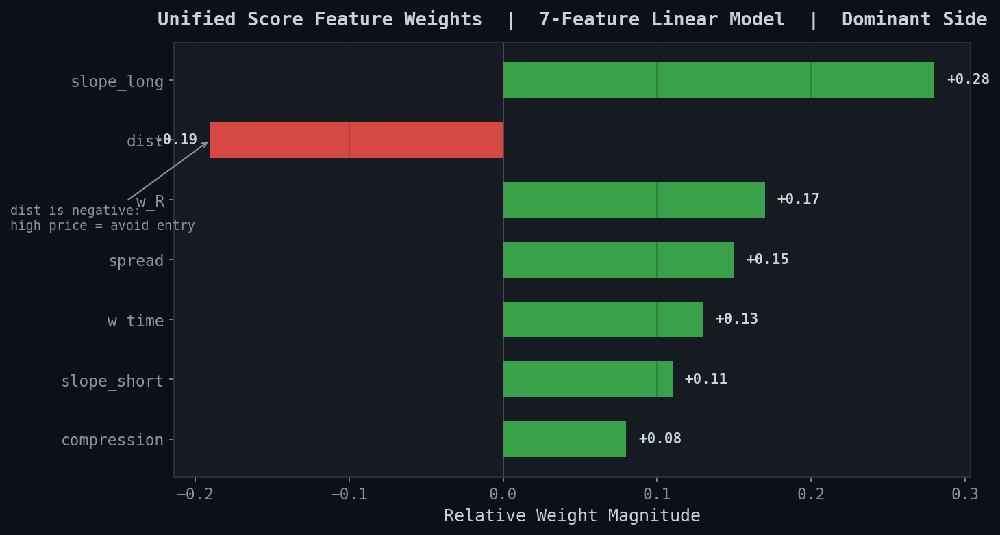
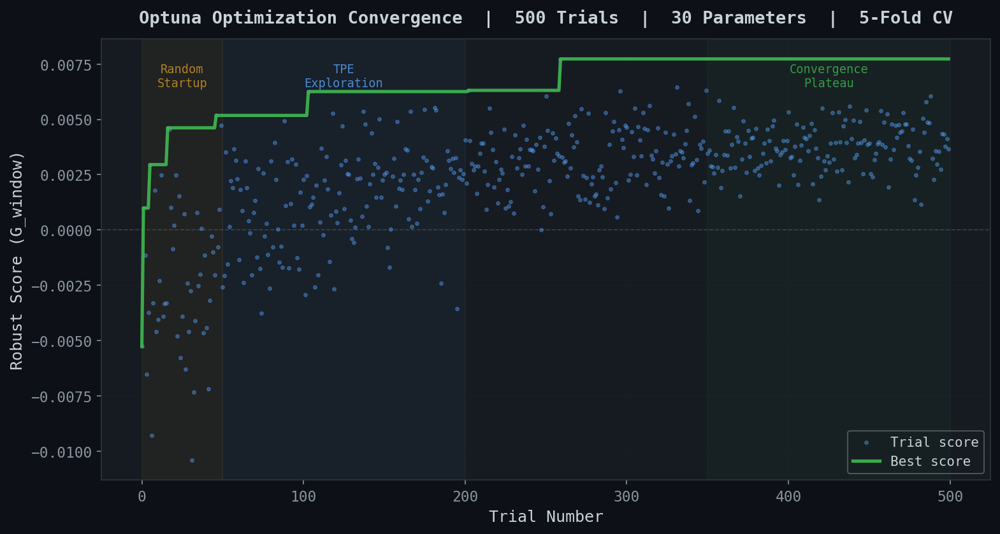
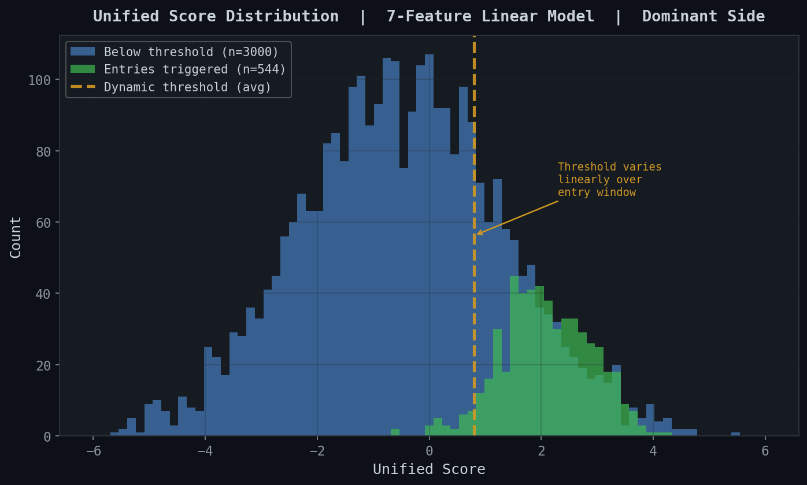
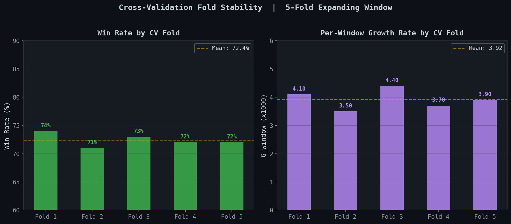
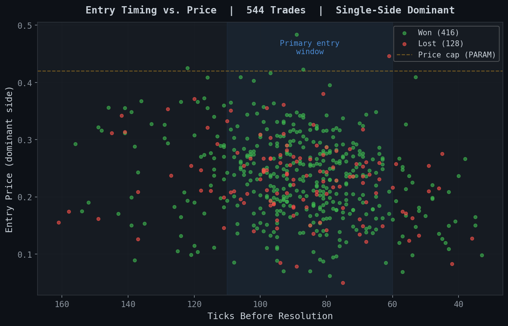

# btc-short-term-alpha

Late-window entry strategy for 15-minute BTC binary markets.

Binary BTC markets on Polymarket resolve every 15 minutes. Within each window, a 7-feature linear scoring function built from moving average microstructure detects patterns -- reversions, growing directional confidence, compression-expansion cycles -- that indicate mispricing between the binary contract and the implied spot outcome. The optimizer found that one side was systematically overvalued, converging on a single dominant side. Optimized via a per-window growth rate objective with robust cross-validation scoring, validated on 544 walk-forward trades at 72.4% win rate (71.3% on holdout).

## Architecture

```
    BTC Spot Price (15-min binary markets)
         |
         v
    +------------------------------------+
    |   Feature Engineering (5 MA)       |
    |   slope_short, slope_long, spread, |
    |   compression, dist                |
    +----------------+-------------------+
                     |
                     v
    +------------------------------------+
    |   Unified Score (7 features)       |
    |   score = sum w_i * feature_i      |
    |   + w_R * R + w_time * progress    |
    +----------------+-------------------+
                     |
                     v
    +------------------------------------+
    |   Entry Filters                    |
    |   - Time window gate              |
    |   - Volatility gate               |
    |   - Score > dynamic threshold      |
    |   - Price cap                      |
    |   - Single-side constraint         |
    +----------------+-------------------+
                     |
                     v
    +------------------------------------+
    |   Position Sizing                  |
    |   Kelly x score_excess multiplier  |
    |   Health overlay (rolling WR)      |
    +----------------+-------------------+
                     |
                     v
    +------------------------------------+
    |   Hold -> Resolution               |
    |   Binary market resolves at T=15m  |
    +------------------------------------+
```

## Key Results

| Metric | Value |
|--------|-------|
| Walk-forward trades | 544 |
| Win rate | 72.4% (71.3% holdout) |
| R (win/loss ratio) | 0.90 |
| Dominant side | Single side (optimizer-selected, redacted) |
| CV folds | 5 (expanding window) |
| Parameters | 30 (15 YES + 15 NO) |
| Execution | FAK orders, $0.10 slippage assumption |
| Optimization | Per-window growth rate + robust scoring |

## Figures

| | |
|---|---|
|  |  |
|  |  |
|  |  |

## The Optimization Objective

The core problem in trading strategy optimization is avoiding degenerate solutions. Maximizing total return leads to trading everything at any quality. Maximizing per-trade return leads to trading rarely at extreme quality. Even Sharpe ratio can be gamed by many correlated small trades.

The initial design used a geometric mean of per-window and per-trade growth rates: `G = sqrt(G_window * G_trade)`. In practice, G_trade dominated the objective -- the optimizer would sacrifice frequency to inflate per-trade quality, producing a subtler version of the same degeneracy. The production objective uses `G_window = total_log_return / n_windows` directly, which rewards both frequency (more trades accumulate more return) and quality (bad trades reduce the numerator). The degenerate solutions are prevented by the robust scoring layer rather than by balancing two G components.

Robust scoring wraps the per-fold G_window values: `robust_score = min(fold_Gs) - 0.5 * std(fold_Gs)`. This focuses the optimizer on worst-case fold performance and penalizes parameter sets that are unstable across folds. A parameter set with consistent but moderate performance across all 5 folds scores higher than one with high average but a single failing fold. The connection to Kelly criterion is direct -- log returns are the natural unit for growth rate optimization.

## The Optimizer Found Asymmetry

The optimization ran over a 30-parameter space (15 parameters per side: 7 score weights, entry window bounds, volatility gate, price cap, threshold trajectory, and score scale). The optimizer converged on a solution where one side's parameters effectively never trigger -- tight entry windows, high thresholds, or restrictive price caps that disable entries entirely, letting the other side carry the strategy. Which side dominates is redacted.

This is an important empirical result, not a design choice. The strategy framework is symmetric -- it evaluates both sides at every tick and takes the higher-scoring entry. But the market microstructure signal turned out to be one-directional. Attempting to force the optimizer to trade both sides (by adding a balance penalty) degraded performance, confirming that the asymmetry is real and not an optimization artifact.

## Skills Demonstrated

- **Feature engineering from market microstructure** -- 5 continuous MA features extracted from binary market price series, normalized as percentage deviations for cross-market comparability
- **Linear factor model design** -- 7-feature scoring function with interpretable weights, intentionally avoiding interaction terms to prevent overfitting on a 30-parameter space
- **Novel optimization objective** -- Per-window growth rate with robust scoring (min - 0.5*std across folds) that prevents degenerate frequency/quality tradeoffs
- **Walk-forward cross-validation** -- 5-fold expanding windows with 20% holdout, 1,500 startup trials for adequate parameter space exploration before TPE kicks in
- **Position sizing theory** -- Kelly-consistent log returns, score-based dynamic sizing, three-layer multiplicative system (z-score, slope, R-ratio) simplified to single-layer for production
- **Overfitting prevention** -- Parameter count management (30 params with 1,500 startup), robust scoring (min - 0.5*std across folds), expanding-window CV preventing look-ahead bias
- **Risk management** -- Health overlay with hysteresis (immediate step-down, cooldown step-up), volatility gates, price caps, cold-start avoidance

## Code Structure

```
strategy/
  features.py         -- 5 continuous MA features from price microstructure
  unified_score.py    -- Linear factor model: score = sum w_i * feature_i
  lock_in.py          -- Entry logic with filter cascade

optimization/
  geometric_balance.py -- The key showcase: novel objective function
  backtest_engine.py   -- Walk-forward backtest framework

risk/
  position_sizing.py  -- Kelly + score-based dynamic sizing
  risk_overlay.py     -- Rolling WR health monitor with hysteresis

scripts/
  generate_plots.py   -- Reproducible figure generation (all data embedded)
```

## Documentation

| Document | Description |
|----------|-------------|
| [STRATEGY.md](docs/STRATEGY.md) | Lock-in thesis and entry logic |
| [FEATURE_ENGINEERING.md](docs/FEATURE_ENGINEERING.md) | The 5 MA features |
| [GEOMETRIC_BALANCE.md](docs/GEOMETRIC_BALANCE.md) | Optimization objective design and development |
| [BACKTEST_RESULTS.md](docs/BACKTEST_RESULTS.md) | Walk-forward results |
| [POSITION_SIZING.md](docs/POSITION_SIZING.md) | Kelly and score-based sizing |

## Note About Parameters

All live parameters have been replaced with `PARAM_PLACEHOLDER` or `None`. This includes:
- All 30 unified score weights (7 per side x 2 sides + thresholds + sizing)
- MA periods, entry windows, price caps, volatility thresholds
- Kelly fraction, slippage assumptions, score scale values
- Optuna search ranges (structural descriptions only, no exact bounds)

The code is fully functional structurally -- supply your own parameters via Optuna optimization on your own data.

## Related Projects

- [polymarket-sdk](https://github.com/pascal-labs/polymarket-sdk) -- Python SDK for Polymarket CLOB API
- [pulsefeed](https://github.com/pascal-labs/pulsefeed) -- Multi-exchange crypto data aggregation
- [tweet-volume-ensemble](https://github.com/pascal-labs/tweet-volume-ensemble) -- 6-model probabilistic ensemble for tweet volume forecasting

## License

MIT License. See [LICENSE](LICENSE).
